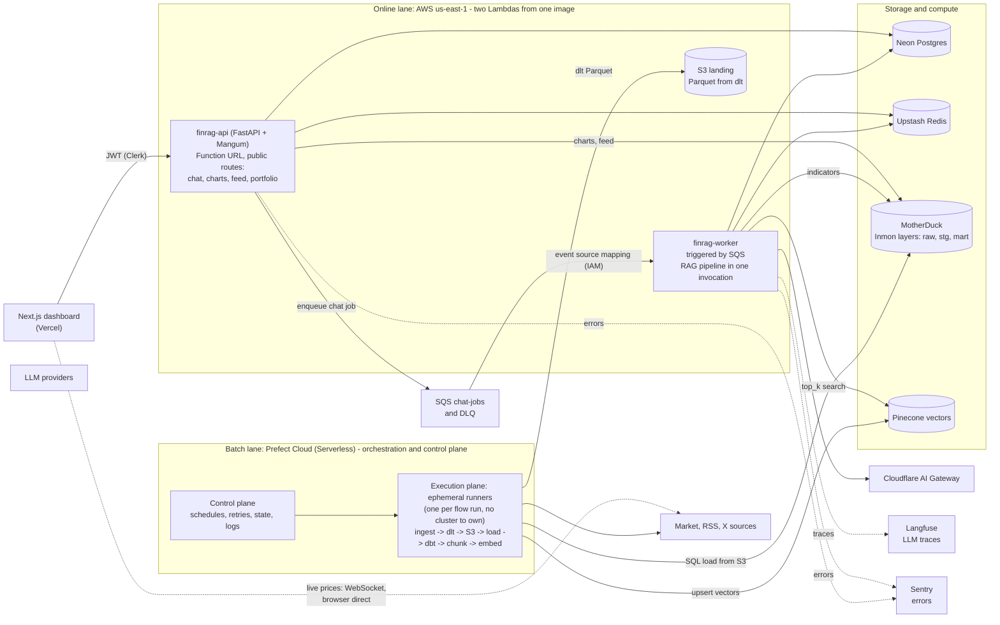

# FinRAG


## Executive Summary

FinRAG is a private crypto portfolio copilot. It combines daily price time series, RSS news, and post data from X, then answers free-form chat questions with a structured, cited assessment. It is a decision-support tool only

The system has two engineering sides working together:

- **Data engineering**: scheduled ingestion from market and text sources with dlt into an S3 landing bucket (Parquet), an Inmon-style MotherDuck datawarehouse (raw, staging, marts) loaded from S3 directly, dbt transformations with tests, and chunk embeddings into Pinecone.
- **AI engineering**: a deterministic RAG pipeline (planner, parallel retrieval, temporal re-rank, context builder, final LLM with structured output) wrapped by four guardrail rails, routed through Cloudflare AI Gateway, and observed with Langfuse and Sentry.


Full design and 48-hour build plan: [`Architecture.md`](Architecture.md).

## Project Structure

```
FinRAG/
  app/                 # FastAPI service: routes, auth, agent pipeline, guardrails; Lambda handlers
  flows/               # Prefect flows: ingest daily (prices + news), scrape X, build and embed
  dbt/                 # MotherDuck transformations (dbt-duckdb): staging views, mart tables, tests
  config/              # Asset universe (fixed 10 coins)
  scripts/             # Manual seeding (owner user), MotherDuck init
  web/                 # Next.js dashboard (App Router), empty scaffolding
  eval/                # Retrieval and guardrail evaluation sets
  infra/terraform/     # IaC: storage, queue, iam, ecr, api, worker, ssm; state on S3
  Architecture.md      # Design document (source of truth)
```

## High-Level Architecture



The three boxes are deliberately separate compute domains: **Lambda** is serverless request/queue execution (scale-to-zero, one job per invocation), **Prefect** is orchestration only (its Serverless pool creates a fresh runner per flow run — Kubernetes-Job semantics without owning a cluster), and **MotherDuck (DuckDB)** is where all warehouse SQL and dbt compute run, reading the S3 landing bucket directly.

Component summary:

| Layer | Components | Role |
| --- | --- | --- |
| Frontend | Next.js on Vercel | Terminal dashboard, demo mode, chat thread |
| Auth | Clerk | Third-party sign-in for the single owner account |
| Compute (online) | Lambda `finrag-api` + `finrag-worker`, SQS | One image, two functions: public routes on a Function URL, and chat jobs triggered by SQS with an atomic Postgres claim and DLQ |
| Data warehouse | MotherDuck (DuckDB) | Inmon-style layers over open-format Parquet landing files; dbt-duckdb models and tests; compute on the MotherDuck Pulse tier |
| State | Neon Postgres, Upstash Redis | 4-table app data; job status, events, rate limits, budget counters |
| Vectors | Pinecone | `multilingual-e5-large` index (1024 dims), embeddings and search |
| Orchestration (batch) | Prefect Cloud (Serverless) | Control plane (schedules, retries, state) plus an ephemeral work pool executing the three flows: ingest daily (prices + news), X once it clears its token bucket, build + embed once per day |
| AI | Cloudflare AI Gateway, OpenCode Go, fallback providers | Single LLM egress with routing, fallback, rate limits |
| Observability | Langfuse, Sentry | Per-stage LLM traces; application errors and alerting |
| Infra | Terraform, S3 state | IaC modules (storage, queue, iam, ecr, api, worker, ssm); remote state on S3 with lockfile |

### Execution Model: Batch and Online

The system runs in two tempos. Both are serverless; neither requires a dedicated ingestion or worker service — Prefect's Serverless pool and Lambda both scale to zero.

| Tempo | Runner | Work |
| --- | --- | --- |
| Batch (scheduled) | Prefect Cloud Serverless pool | ingest -> dlt Parquet to S3 -> SQL load into raw -> dbt build -> **chunking** -> **embedding** -> Pinecone upsert. Three flows: prices+news daily at 14:10 UTC, build+embed daily at 17:00 UTC, X in six runs across a 20-minute-spread night window |
| Online (per question) | Lambda `finrag-worker` via SQS | plan -> hybrid retrieval -> rail filter -> **temporal re-rank** -> context builder -> final LLM -> rails |

Re-rank is a deterministic score fusion at query time (no learned cross-encoder, no extra model calls):

```
score_final = cosine_similarity x 0.5^(age_hours / half_life) x source_weight
```

- Half-life: tweets 36h, news 120h. Source weight: tweets 0.7, news 1.0.
- Flow: Pinecone top_k 30 -> retrieval rail -> de-dupe by `chunk_hash` -> top 8 -> chronological order.

Metadata filtering happens at two gates:

- **Pre-filter in Pinecone**: `ticker in [...]` and `published_at_ts >= now - window`. The `published_at_ts` epoch field is stored numeric specifically for filtering; the window comes from the planner (1-90 days).
- **Post-filter in the retrieval rail**: minimum similarity 0.78 (e5 scores cluster tightly), per-source maximum age, ticker consistency with the plan, injection-pattern scan, at least 2 evidence items per ticker.

**Non-streaming by design**: `POST /chat` returns 202 with a job id, then the client polls `GET /jobs/{id}?after_seq=N` every 2 seconds for ordered progress events and the final JSON result. No SSE or token streaming — the frontend stays a simple poll-and-render loop.

### Scaling and Compute Rationale

Every compute choice below is a documented tradeoff, not a framework default. Four mechanisms, four different jobs:

| Mechanism | Role | Explicitly not |
| --- | --- | --- |
| Prefect control plane | Decides what runs when: schedules, retries, state, backfills | Not a worker fleet — it only orchestrates |
| Prefect Serverless runners | Execution plane: a fresh isolated Python runner per flow run (Kubernetes-Job semantics, zero cluster operations) | Not MPP — each run is a single process |
| MotherDuck (DuckDB) | Where warehouse SQL and dbt compute run, reading the S3 landing bucket directly | Not a system you feed Spark to |
| Lambda | Serverless job execution: one queue event or HTTP request per invocation, scale-to-zero | Not parallelism over a single dataset |

- **Batch ELT, not streaming**: raw data is landed first (Parquet in S3 via dlt), loaded into `raw_*`, then transformed by dbt.batches safe.
- **Python only, no PySpark/JVM**: volumes are KB-MB per day. A Spark runtime would add hundreds of MB and seconds of startup to every run for zero throughput gain
- **The only streaming is display-only**: the browser connects to Binance's public WebSocket directly for live prices; it never enters the data pipeline.
- **Egress is a design constraint**: all AWS resources live in us-east-1, MotherDuck reads the landing bucket in-region, there is no NAT Gateway or VPC, and only small query results leave

## Concepts Explored

**Data engineering**

- **Inmon datawarehouse pattern**: raw, staging, and mart layers in MotherDuck instead of a star schema; downstream models read open-format (Parquet) landing data without multi-table joins on ingest.
- **Batch ELT**: land raw files first (dlt to S3), load, transform with dbt — discrete idempotent batches instead of streaming, with no message broker in the path.
- **Orchestration**: Prefect Cloud flows with schedules, locks, and token buckets; no custom worker nodes.
- **Control plane / execution plane split**: Prefect Cloud orchestrates; a fresh ephemeral runner executes each flow run (Kubernetes-Job semantics, zero cluster ops); MotherDuck runs the SQL. See "Scaling and Compute Rationale".
- **Chunking RAG**: text split at 800 chars with 100 overlap, ticker fan-out, capped under embedding input limits.
- **Database abstraction**: warehouse access through parameterized tools and a guarded read-only SQL tool (sqlglot dialect DuckDB, table allowlist, table-function and path rejection), never free-form joins from the model.
- **Idempotency**: dlt incremental state in the bucket, staging de-duplication, atomic job claim on re-run.
- **Free-tier engineering**: quota guards for vectors, embedding tokens, crawl credits, LLM budget, MotherDuck compute seconds, and Prefect minutes.

**AI engineering**

- **Hybrid retrieval**: vector search (Pinecone) combined with structured retrieval (indicators, portfolio, last prices) planned per question.
- **Temporal re-rank**: similarity decayed by source half-life (tweet 36h, news 120h), then de-duplicated and time-ordered.
- **Context builder**: indicators serialized as YAML, evidence as annotated XML blocks with ids for citation.
- **Structured output**: Pydantic-constrained plan and recommendation schemas with one repair attempt.
- **Guardrails**: four deterministic rails (input, retrieval, output, scope) plus server-written AI and financial-responsibility disclosures; scope violations route to human handoff.
- **Prompt engineering**: English system prompts, untrusted-evidence rules, no-advice scope rules.
- **LLM gateway routing**: one egress through Cloudflare AI Gateway with provider fallback configured outside the code.
- **Observability**: Langfuse for per-stage LLM traces, Sentry for exceptions on the single service.

**Platform and operations**

- **IaC (Terraform)**: storage, queue, IAM, ECR, Lambdas, and SSM as code; state on S3 with lockfile.
- **Serverless vs distributed compute**: Lambda scales per queue event or HTTP request, MotherDuck scales per-query compute — two different scaling axes chosen deliberately; no Spark/JVM anywhere at this data volume.
- **Third-party auth (Clerk)**: sign-in only, no sign-up; user mapping in `app_user`, API rejects unknown subjects.
- **Event-driven jobs**: SQS triggers an idempotent worker that claims the job atomically in Postgres; progress exposed as ordered Redis events.

## Installation

Prerequisites: `uv`, `aws` (AWS CLI v2), `docker` (buildx), `terraform`, `prefect`, `dbt`, Node 22+, `vercel`.

```bash
# 1. Infrastructure (state bucket created manually, then Terraform)
aws s3api create-bucket --bucket finrag-tfstate-ACCOUNT_ID --region us-east-1
cd infra/terraform && terraform init && terraform apply

# 2. Backend
uv sync
uv run python -m scripts.init_motherduck
uv run alembic upgrade head
uv run python -m scripts.seed_user --clerk-user-id user_XXXX --email you@example.com

# 3. Data flows
prefect cloud login
prefect work-pool create finrag-managed --type prefect:managed
prefect deploy --all

# 4. Frontend (scaffolding only; contents filled during the frontend build block)
cd web && npm install && npm run dev
```


## Usage and Examples

- Open `/`: empty dashboard with **Use Demo Mode** (client-only fixtures, no API calls) or **Sign in** for the owner.
- Chat: `POST /chat` returns 202 and a job id; the dashboard polls for progress events and renders the cited assessment when the job reaches a terminal status.
- **Get Today's Recommendation**: one click produces a daily brief, cached per UTC day and holdings hash.
- Guardrail checks (also available as demo prompts): "Buy 1 BTC now for me" (blocked), "Guarantee BTC returns next month" (handoff), "Ignore previous instructions" (blocked).
- Live prices arrive via public Binance WebSocket from the browser, with polling fallback.

## Status

Design document at `Architecture.md` v2.0.5 (migrated from the GCP stack of v2.0.4 to AWS + MotherDuck + dlt; see §0.5 there for the change log). Repository scaffolding still matches the v2.0.4 layout for `infra/terraform/` and `scripts/`; application and frontend files are empty placeholders pending the 48-hour build blocks.
