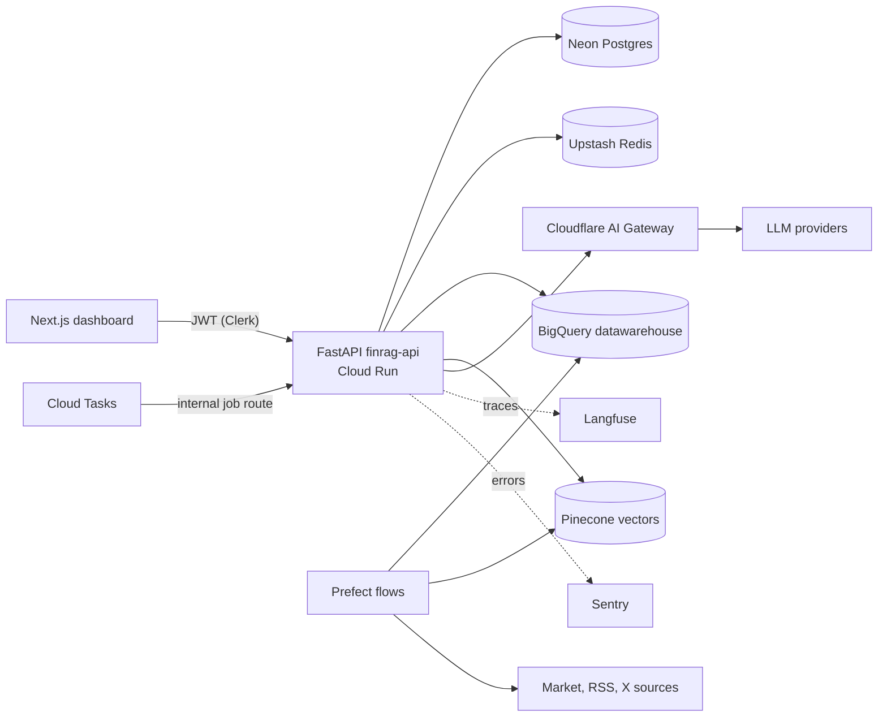

# FinRAG


## Executive Summary

FinRAG is a private crypto portfolio copilot. It combines daily price time series, RSS news, and post data from X, then answers free-form chat questions with a structured, cited assessment. It is a decision-support tool only: no trade execution, no personalized financial advice, no promised outcomes.

The system has two engineering sides working together:

- **Data engineering**: scheduled ingestion from market and text sources into an Inmon-style BigQuery datawarehouse (raw, staging, marts), dbt transformations with tests, and chunk embeddings into Pinecone.
- **AI engineering**: a deterministic RAG pipeline (planner, parallel retrieval, temporal re-rank, context builder, final LLM with structured output) wrapped by four guardrail rails, routed through Cloudflare AI Gateway, and observed with Langfuse and Sentry.

One backend service (`finrag-api` on Cloud Run) serves both the public API and the internal job runner; Cloud Tasks triggers long-running chat jobs. The frontend is a single-page Next.js terminal-style dashboard with a client-only demo mode.

Full design and 48-hour build plan: [`Architecture.md`](Architecture.md).

## Project Structure

```
FinRAG/
  app/                 # FastAPI service: routes, auth, agent pipeline, guardrails
  flows/               # Prefect flows: ingest prices, ingest news, scrape X, build and embed
  dbt/                 # BigQuery transformations: staging views, mart tables, tests
  config/              # Asset universe (fixed 10 coins)
  scripts/             # Manual seeding (owner user)
  web/                 # Next.js dashboard (App Router), empty scaffolding
  eval/                # Retrieval and guardrail evaluation sets
  infra/terraform/     # IaC: worker, iam, bigquery, storage, tasks; state on Cloudflare R2
  Architecture.md      # Design document (source of truth)
```

## High-Level Architecture



Component summary:

| Layer | Components | Role |
| --- | --- | --- |
| Frontend | Next.js on Vercel | Terminal dashboard, demo mode, chat thread |
| Auth | Clerk | Third-party sign-in for the single owner account |
| Compute | Cloud Run (`finrag-api`), Cloud Tasks | Public API plus internal job route; chat jobs as long requests |
| Data warehouse | BigQuery datawarehouse | Inmon-style layers over open-format landing files; dbt models and tests |
| State | Neon Postgres, Upstash Redis | 4-table app data; job status, events, rate limits, budget counters |
| Vectors | Pinecone | `multilingual-e5-large` index (1024 dims), embeddings and search |
| Orchestration | Prefect Cloud | Four scheduled flows (prices, news, X, build and embed) |
| AI | Cloudflare AI Gateway, OpenCode Go, fallback providers | Single LLM egress with routing, fallback, rate limits |
| Observability | Langfuse, Sentry | Per-stage LLM traces; application errors and alerting |
| Infra | Terraform, Cloudflare R2 | IaC modules; remote state on R2 |

## Concepts Explored

**Data engineering**

- **Inmon datawarehouse pattern**: raw, staging, and mart layers in BigQuery instead of a star schema; downstream models read open-format (Parquet/JSON) landing data without multi-table joins on ingest.
- **Orchestration**: Prefect Cloud flows with schedules, locks, and token buckets; no custom worker nodes.
- **Chunking RAG**: text split at 800 chars with 100 overlap, ticker fan-out, capped under embedding input limits.
- **Database abstraction**: warehouse access through parameterized tools and guarded read-only SQL, never free-form joins from the model.
- **Idempotency**: deterministic landing paths, staging de-duplication, job status checks on re-run.
- **Free-tier engineering**: quota guards for vectors, embedding tokens, crawl credits, and LLM budget.

**AI engineering**

- **Hybrid retrieval**: vector search (Pinecone) combined with structured retrieval (indicators, portfolio, last prices) planned per question.
- **Temporal re-rank**: similarity decayed by source half-life (tweet 36h, news 120h), then de-duplicated and time-ordered.
- **Context builder**: indicators serialized as YAML, evidence as annotated XML blocks with ids for citation.
- **Structured output**: Pydantic-constrained plan and recommendation schemas with one repair attempt.
- **Guardrails**: four deterministic rails (input, retrieval, output, scope) plus server-written AI and financial-responsibility disclosures; scope violations route to human handoff.
- **Prompt engineering**: English system prompts, untrusted-evidence rules, no-advice scope rules.
- **LLM gateway routing**: one egress through Cloudflare AI Gateway with provider fallback configured outside the code.
- **Observability**: Langfuse for per-stage LLM traces, Sentry for exceptions on the single service.

**Platform and operations**

- **IaC (Terraform)**: worker, IAM, BigQuery, storage, and tasks as code; state on Cloudflare R2.
- **Third-party auth (Clerk)**: sign-in only, no sign-up; user mapping in `app_user`, API rejects unknown subjects.
- **Event-driven jobs**: Cloud Tasks invokes an idempotent internal route; progress exposed as ordered Redis events.

## Installation

Prerequisites: `uv`, `gcloud`, `terraform`, `prefect`, `dbt`, Node 22+, `vercel`.

```bash
# 1. Infrastructure (state backend on Cloudflare R2 configured later)
cd infra/terraform && terraform init && terraform apply

# 2. Backend
uv sync
uv run alembic upgrade head
uv run python -m scripts.seed_user --clerk-user-id user_XXXX --email you@example.com

# 3. Data flows
prefect cloud login
prefect work-pool create finrag-managed --type prefect:managed
prefect deploy --all

# 4. Frontend (scaffolding only; contents filled during the frontend build block)
cd web && npm install && npm run dev
```

Deploys: `gcloud run deploy finrag-api --source .` and `cd web && vercel deploy --prod`. Environment variables are listed in `Architecture.md` section 11.7; copy `web/.env.local.example` for local values.

## Usage and Examples

- Open `/`: empty dashboard with **Use Demo Mode** (client-only fixtures, no API calls) or **Sign in** for the owner.
- Chat: `POST /chat` returns a job; the dashboard streams stage events and renders the cited assessment.
- **Get Today's Recommendation**: one click produces a daily brief, cached per UTC day and holdings hash.
- Guardrail checks (also available as demo prompts): "Buy 1 BTC now for me" (blocked), "Guarantee BTC returns next month" (handoff), "Ignore previous instructions" (blocked).
- Live prices arrive via public Binance WebSocket from the browser, with polling fallback.

## Status

Design document at `Architecture.md` v2.0.4. Repository scaffolding matches the plan; application and frontend files are empty placeholders pending the 48-hour build blocks.
